---

### 👨‍💻 Sobre mim

Sou **Luiz Guilherme**, estudante de **Análise e Desenvolvimento de Sistemas na UNA** e **Técnico em Informática pelo SENAC**.

Tenho interesse em **desenvolvimento de software, redes, infraestrutura, suporte técnico e cybersegurança**, buscando transformar o que aprendo em projetos práticos.

Atualmente, estou ampliando meus conhecimentos em programação e desenvolvimento de aplicações por meio de projetos acadêmicos e pessoais.

---

<h3 align="left">🎯 Objetivo</h3>

Busco uma oportunidade de **estágio ou posição de nível inicial em Tecnologia da Informação**, com o objetivo de aplicar meus conhecimentos, desenvolver novas competências e adquirir experiência profissional.

---

<h3 align="left">📚 Formação</h3>

- 🎓 **Análise e Desenvolvimento de Sistemas** — UNA Pouso Alegre *(em andamento)*
- 💻 **Técnico em Informática** — SENAC Pouso Alegre *(em andamento)*
- 🎓 **Ensino Médio Completo** — Escola Estadual Virgília Paschoal *(2022)*

---

<h3 align="left">🚀 Projetos</h3>

- 🎮 **Delta Trigger** — RPG textual desenvolvido como projeto acadêmico.
- 🚌 **Expresso Planalto** — aplicação com horários, informações e notícias para usuários do transporte.
- 🌐 **Sites e aplicações acadêmicas** — projetos desenvolvidos durante a formação técnica.
- 🔐 **Projeto de Redes e Cibersegurança** — reorganização de IPs e conscientização em segurança digital.
- 🖥️ **Infraestrutura da APAC** — manutenção, limpeza, formatação e configuração de computadores.
- 📦 **Sistema logístico da APAC** — projeto desenvolvido em parceria com a Magatron.
- 🔎 **Site de itens perdidos** — Projeto Integrador em desenvolvimento.
- 🎮 **Criação de jogos** — projetos utilizando Construct e edição gráfica.

---

<h3 align="left">🛠️ Tecnologias e ferramentas</h3>

 

**Também:** Redes de computadores • Suporte técnico • Manutenção de computadores • Cibersegurança • Construct • Photoshop • Figma

---

<h3 align="left">📫 Conecte-se comigo</h3>

---

### 📊 GitHub Stats

---

### 🐍 Minhas contribuições

<picture>
  <source media="(prefers-color-scheme: dark)" srcset="https://raw.githubusercontent.com/Guivilhena2005/Guivilhena2005/output/github-contribution-grid-snake-dark.svg">
  <source media="(prefers-color-scheme: light)" srcset="https://raw.githubusercontent.com/Guivilhena2005/Guivilhena2005/output/github-contribution-grid-snake.svg">
  
</picture>

---

💻 **Sempre aprendendo, desenvolvendo e evoluindo.**

